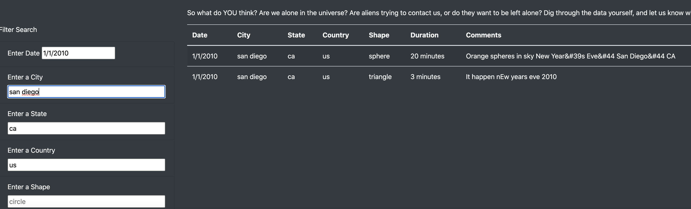
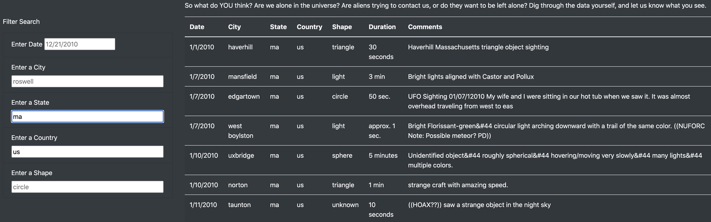
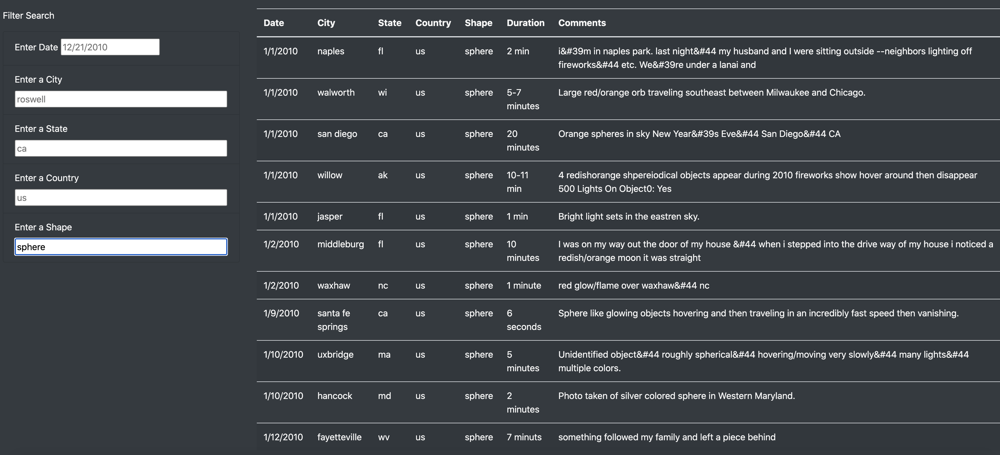

# **UFOs - the study of Unidentified Flying Object sightings data**
- UFO sightings data presented using javascript in html page enhanced visually with bootstrap and CSS.
---
## Overview of the Project :
- Dana was provided with data.js file with data on the UFO sightings recorded overtime which summed up to 111 UFO sighting records.
- With this data in hand, Dana had to come up with a webpage on UFO having a dynamic table using which users can analyse the UFO sightings data.
- For the table to be dynamic, Dana had to provide multiple filters using which users can filter the data in terms of the date the sighting occured, city, state or country it occured, and the shape of the UFO observed.
- The javascript file can be opened using this link : <a href="https://github.com/VinuthaBS/UFOs/blob/main/static/js/app.js">------> UFO - Javascript app file</a>
- The html file can be opened using this link : <a href="https://github.com/VinuthaBS/UFOs/blob/main/index.html">------> UFO - index.html file</a>
## **UFO analysis Results**
- Typically the UFO html webpage will be used to filter the data presented in the table. 
- As the webpage is already coded to support multiple filters, users would want to filter on a particular date and place of occurence. For eg. date = 1/1/2010, Country = us, State = ca, City = san diego and the results show up as shown below on the webpage.
- </img>
- Selecting any of the filter criteria as shown above, user can either press "Enter" or "return" or "tab" key on the keyboard or can click anywhere else in the webpage out of the input box boundaries, the filter gets the matching data and loads only the matching records in the table.
- Users can filter on the place sightings occured, for eg Country = us and State = ma as shown below :
- </img>
- Users can also filter on the shape of the sighted UFOs for eg shape = sphere and the results show up as shown below : 
- </img>
---
## **Summary**
- Though the webpage serves the users to filter the data with multiple filters pretty well, it has drawback around the search text supplied for each filter as it expects the users to supply the complete text of the value and cannot search with partial text supplied. For eg if City has to be searched for "san diego" user has to supply the complete text. If user enters the City as "san" it doesnt return any records. 
- Also the search text is not handled when the case of the text doesnot match the table value. For eg is "san diego" is supplied as "San Diego" or "SAN DIEGO" the webpage returns no records which is misleading for the user. 
- When the data is in thousands or more, the above mentioned functionalities matters a lot for ease of search for the users. Also in the current dataset the data seems to be not very clean and there is scope for cleaning the data bit more so that values like unknown or irrelevant values can be fixed.
- Additional development recommendations are as follows :
- Webpage filters functionality can be enhanced by displaying the "Number of RECORDS" found matching for the current filter on the column headers bar.
- Instead of having a separate "Filter Search" section beside the table, filters can be implemented under the corresponding column headers with unique values of the column preloaded as a dropdown. This will add up to ease of use and also can accomodate bigger data having lots of columns.
- Table section can be updated to have pagination in place to show up the results keeping the number of records displayed in each page customizable for eg 25 records or 50 records for each page if total data is in the range of thousands.
---
---